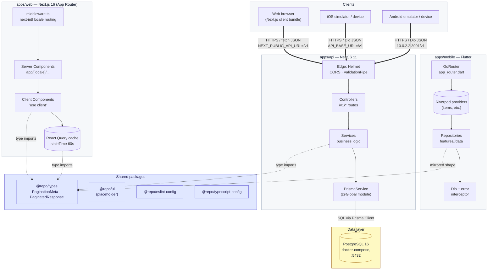

# Architecture

How the workshop starter is wired together — what each app does, how they talk, and where to plug things in when you outgrow the defaults.

## High-level shape

```
                ┌─────────────────────────────────────┐
                │            Workshop Repo            │
                │  (Turborepo monorepo, single PR     │
                │   touches whichever apps it needs)  │
                └─────────────────────────────────────┘

   ┌───────────────────┐   ┌───────────────────┐   ┌───────────────────┐
   │     apps/web      │   │     apps/api      │   │   apps/mobile     │
   │  Next.js 16 SSR   │   │   NestJS HTTP     │   │  Flutter native   │
   │  React Query      │◀──│  Prisma → PG      │──▶│  Riverpod + Dio   │
   │  shadcn/ui        │   │  /v1 routes       │   │  GoRouter         │
   └───────────────────┘   └───────────────────┘   └───────────────────┘
              │                       │                       │
              └───────────┬───────────┴───────────┬───────────┘
                          ▼                       ▼
                ┌───────────────────┐   ┌───────────────────┐
                │  packages/types   │   │  PostgreSQL 16    │
                │  shared TS types  │   │  via docker-compose│
                └───────────────────┘   └───────────────────┘
```

## System diagram

The same picture as a system-design diagram — clients on top, the two frontend apps in the middle, the API and database below, with shared packages and local infra called out.



**What the edges say**

- **Solid double-arrows** (`==>`) — runtime HTTP traffic from a client tier into the API edge. CORS, Helmet, and the global `ValidationPipe` run on every one of those calls.
- **Solid single-arrows** (`-->`) — in-process calls within an app or a database driver call (Prisma → PostgreSQL).
- **Dotted arrows** (`-.->`) — build-time / compile-time relationships: TypeScript imports from `@repo/types`, or the mobile Freezed `Item` model mirroring the API contract by hand.

**What the diagram intentionally leaves out**

- **No auth boundary** — every `/v1/*` route is public today. When auth is added, a guard sits between *Edge* and *Controllers* on the API side and an interceptor sits between *Repositories* and *Dio* on mobile / between *Client Components* and *fetch* on web (see `system-design.md`).
- **No CDN, cache, or queue** — the starter goes browser → API → PostgreSQL with no Redis, no S3, no SQS, no CloudFront. Those plug-in points are tabled in the "Extension points" section below.
- **No background workers** — there is no separate worker pool; the API process handles every request synchronously.

## Apps

### `apps/api` — NestJS

Backend HTTP API. One entry point (`main.ts`), modular features under `src/<feature>/` (controller + service + DTOs + specs). All routes prefixed `/v1`. Validation is enforced at the edge by class-validator. Prisma talks to PostgreSQL — schema lives at `apps/api/prisma/schema.prisma`, migrations under `apps/api/prisma/migrations/`.

The Items module is the reference template: copy its shape (controller → service → DTOs → spec) for any new feature.

### `apps/web` — Next.js 16

Web frontend with App Router and the locale-aware routing pattern (`app/[locale]/...`). Server components by default, client components only where state, effects, or browser APIs are needed. shadcn/ui primitives live in `components/ui/`, feature components in `components/<feature>/`. React Query hooks under `hooks/use-<feature>.ts` wrap the API calls. Translations live in `locales/en/<namespace>.json` and are accessed via `useTranslations('<namespace>')`.

### `apps/mobile` — Flutter

Native iOS/Android app. Feature-first — each feature has `data/` (repository), `providers/` (Riverpod), `presentation/` (screens). Shared infrastructure under `lib/core/` (env, network, routing, theme, l10n, widgets). Models use Freezed; routes use GoRouter; HTTP goes through Dio with an error interceptor that maps to typed `AppException` subclasses.

## Shared packages

| Package | Purpose |
|---------|---------|
| `packages/types` | TypeScript types and pagination contracts shared between `apps/api` and `apps/web` |
| `packages/ui` | Shared React components — placeholder, expand as the project grows |
| `packages/eslint-config` | Flat-config ESLint presets (base, next, react-internal) |
| `packages/typescript-config` | Base and Next.js tsconfigs the apps extend |

## Data flow — Items example end-to-end

1. **Web user clicks "Create Item"** → form submits via `useCreateItem` (React Query mutation)
2. **`fetchJson` in `hooks/use-items.ts`** sends `POST /v1/items` with the title/description JSON
3. **NestJS** routes the request to `ItemsController.create`, which validates the DTO via class-validator
4. **`ItemsService.create`** calls `prisma.item.create` to persist
5. **Prisma** writes to the `Item` table in PostgreSQL
6. **Response** flows back: service → controller → JSON over HTTP → React Query mutation success
7. **`onSuccess`** invalidates the `['items']` query key, the list re-fetches, the new item appears

The mobile flow mirrors the web flow:

1. User taps the FAB → `CreateItemScreen` → `ItemsRepository.createItem` (Dio)
2. Same `POST /v1/items` request → same backend handler
3. On success: `ref.invalidate(itemsProvider)` → list provider re-fetches → screen rebuilds

The contract is identical for both consumers because they share `packages/types` for the response shape.

## Cross-app contract rules

- Backend routes are versioned. Web hooks and mobile repositories must use the matching `/v1` paths.
- DTO and response shape changes ship in the same PR as their consumers.
- Enum changes propagate: Prisma schema → `packages/types` → mobile Dart models.
- Pagination response is universal: `{ data: T[], meta: { total, page, limit, totalPages } }`.

## Local development

`docker-compose.yml` at the repo root spins up PostgreSQL on port 5432 with the `workshop` user/password/database. The API connects via `DATABASE_URL` from `apps/api/.env`. The web app connects to the API via `NEXT_PUBLIC_API_URL` (defaults to `http://localhost:3001/v1`). The mobile app uses `--dart-define-from-file=.env` to set `API_BASE_URL` at build time.

A single `npm run dev` from the repo root starts the API (port 3001) and web (port 3000) via Turborepo. Mobile runs separately via `flutter run`.

## Extension points

Where to plug in when you outgrow the starter:

| Need | Where it lands |
|------|----------------|
| Authentication | New `apps/api/src/auth/` module + JWT guard. Web wraps `Providers` with an auth context. Mobile gains `core/auth/` with secure storage. |
| File upload | API adds `multer` + storage adapter; web reuses shadcn `Input type="file"`; mobile uses `image_picker` + Dio multipart. |
| Real-time | API uses `@nestjs/websockets`; web uses `socket.io-client`; mobile uses `socket_io_client`. |
| Push notifications | API integrates AWS SNS or Firebase; mobile adds `firebase_messaging`. |
| Multiple locales | Add `locales/<code>/*.json` and `app_<code>.arb`; register the code in `apps/web/i18n/config.ts`. |
| Cloud images / CDN | Add an `S3Service` (or equivalent) under `src/common/`; expose presigned URL endpoints; web/mobile consume them like any other API response. |
| Background jobs | API gains `@nestjs/schedule` or BullMQ; jobs live in their own module. |
| Production deploys | The `/devops-cicd` skill walks through CDK + Fargate + GitHub Actions for a typical production setup. |

Each extension follows the same "API contract first, then consumers" rule that the Items example demonstrates.
